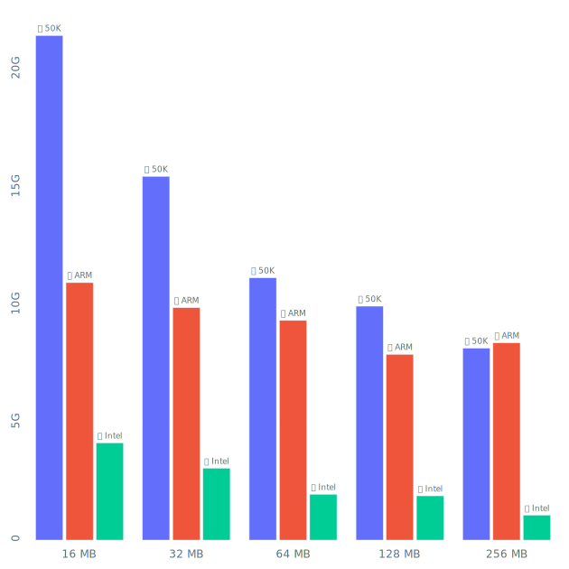
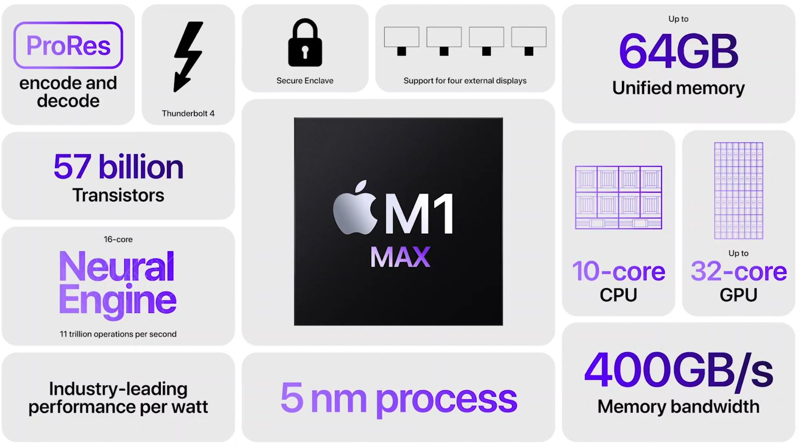
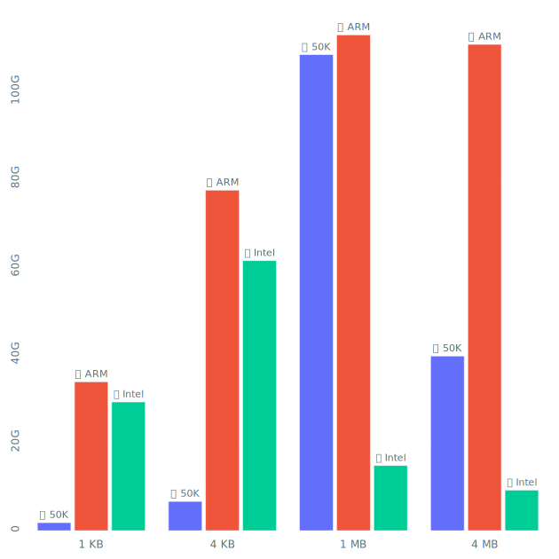
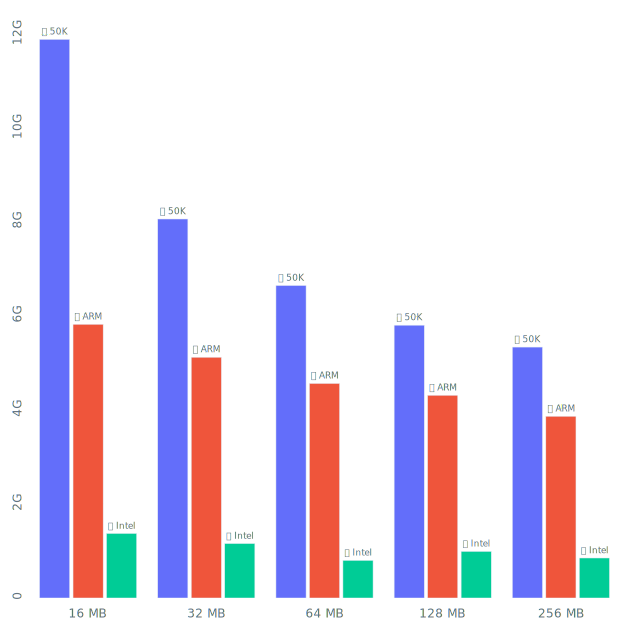
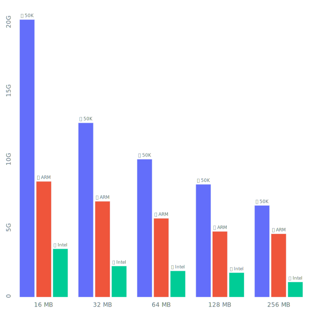

# M1 MacBook Pro vs Intel vs a $50K Super-Workstation: DDR4 vs DDR5 in Hash-Table Workloads

This will be a story about many things: about computers, about their (memory) speed limits, about programs that can push computers to those limits and the subtle differences in program designs. But before we get in, here is a glimpse of what we are about to see.

A couple of months ago I was following one of my oldest traditions, watching Apple present their new products on one of their regular conferences. I do it since the iPhone 4 days and haven't missed a single one. Needless to say, the last 10 years were a rodeo. With hours spent watching new animated ~~poop~~ emojis on iOS presentations I would sometimes loose hope in that $3T company. After the 2012 Macbook Pro every following Mac I bought, was a huge downgrade. The 2015, the 2017 and even the Intel Core i9 16" 2019 version, if we consider performance per buck. Until now.

"M1 Pro Max" for a lack of a sillier name, is vastly different from the M1 in the last years Macbook Airs. Apple hates sharing technical details, but here are [some of the core aspects](https://www.apple.com/newsroom/2021/10/introducing-m1-pro-and-m1-max-the-most-powerful-chips-apple-has-ever-built/):

1. CPU has 8 power-cores and 2 efficiency-cores.
2. Cores have massive L2 blocks for a total of 28 MB of L2.
3. Printing was done via the 5N TSMC litography standard.
4. Memory bus was upgraded to LPDDR5 and claims up to 400 GB/s of bandwidth.

We have recently published a [2736-word overview](https://unum.cloud/post/2021-12-07-supercycle/) of upcoming memory-bus innovations, sot the last one looks exceptionally interesting. In the "von Neumann computer architecture" today, the biggest bottleneck is between memory and compute. It's especially evident in big-data processing and neuromorphic workloads. Both are essential to us, so we invested some time and benchmarked memory-intensive applications on three machines:

1. 16" Apple Macbook Pro with an 8-core Intel Core i9 and 16 GB of DDR4 memory, purchased for around $3'000 in 2019.
2. 16" Apple Macbook Pro with a 10-core ARM-based M1 Pro Max CPU with 64 GB of LPDDR5 memory, purchased for around $3'000 in 2021.
3. A custom-built liquid-cooled workstation with an AMD Threadripper Pro 3995WX with 1 TB of eight-channel DDR4 memory, purchased for around $50'000 in 2021.

Sounds intriguing? Let's jump in!

## Copying Memory

Generally, when companies claim a number like 100 GB/s that, they mean the combined theoretical throughput of all the RAM channels in the most basic possible workload - streaming a lot of data sequentially. Probably the only such use case on the desktop is watching multiple 4K movies at once. Your multimedia player will fetch a ton of frames from memory and will simply put them into the current frame buffer, overwriting the previous content. In the x86 world you would achieve something like that by using a combination of [`_mm256_stream_load_si256`](https://www.intel.com/content/www/us/en/docs/intrinsics-guide/index.html#text=_mm256_stream_load_si256) and [`_mm256_stream_si256`](https://www.intel.com/content/www/us/en/docs/intrinsics-guide/index.html#text=_mm256_stream_si256) instrinsics. Or if you prefer something higher-level, there is a [`memcpy`](https://man7.org/linux/man-pages/man3/memcpy.3.html) in every `libc` distribution.

In this benchmark, we generated a big buffer with lots synthetic random data in it and then every core would just fetch chunks of different size in random order. As we see, there is a lot of non-uniformity in the results. Depending on the size of a copied chunk (1 KB, 4 KB, 1 MB or 4 MB), the evaluation speed may differ a lot. The expectation is that copies below 4 KB won't be efficient, as that's the [classical memory page size](http://www.cs.rpi.edu/academics/courses/fall04/os/c12/) on most systems. As you go bigger, the numbers would generally increase until reaching about 100 GB/s in copied data on newest hardware. All of that bandwidth, of course, almost never affects real life.

* If you are watching videos - you are likely decoding -> bottlenecking on CPUs ALUs.
* If you handle less than 20 MB at a time -> you may never be quiting CPUs L1/L2 caches.

Is there a memory-intensive benchmark, that can translate into real world performance?

## Hash-Tables

Meet [hash-tables](https://en.wikipedia.org/wiki/Hash_table) - probably the simplest, yet most relevant data-structure in all of computing. Every CS freshman can implement it, but even the biggest software companies in the world spend years optimizing and polishing them. Hell, you can build a [$2B software startup like Redis](https://redis.com/press/redis-labs-110-million-series-g-led-by-tiger-global/) on a good hash-table implementation, thats how essential HTs are!

In reality, HT is just key-value store imeplemented as a bunch of memory pockets and an arbitrary mathematical function that routes every key to a bucket in which that data belongs. The problem here, is that generally a tiny change in input data results in a jump to a different memory region. Once it happens, you can't fetch the data from the CPU caches and have to go all the way to RAM! So our logic is the following:

> fast memory -> fast hash-tables -> faster applications -> rainbows, unicorns and profit.

With this unquestionable agenda in mind let's compare some hash-tables on Apples silicon!

## C++ Standard Templates Library: `std::unordered_map`

The most popular high-performance computing language is C++ and it comes with a standard library. A standard library with a bunch of zero-cost abstractions, including some of the fastest data-structures shipped in any programming ecosystem. It's the most common HT, the people will be using, but not the fastest. 

We have configured it in all power-of-two sizes between 16 MB and 256 MB of content. Such a broad range is selected to show both performance within and outside of CPU caches of chosen machines.

The [STL implementation](https://stackoverflow.com/a/31113618) is an array of buckets, where every bucket is a [linked list](https://en.wikipedia.org/wiki/Linked_list). In the default configuration, every node of those linked-lists is allocated in a new place on the heap. Once we get a query, we hash the key, determine the bucket, pick the head of the list and compare our query to every object in the list. This already must sound wastefull in the number of entries we will traverse.

Then, a linked list in each bucket would require storing at least one extra eight-byte pointer per added entry. If you are mapping integers to integers, you will wasting at least hald of the space in the ideal case. Continuing the topic of memory efficiency, allocating nodes on-heap means having even more metadata about you HT stored in another tree datastructure.

## Google Hash Maps Library: `google::dense_hash_map`

If the previous solution sounded a bit bloated, don't worry - Google has you covered! They have a sparse and a dense HT, the second one being generally better across the board.

Googles design is based on the idea of open-adressing. Instead of nesting linked-lists in every bucket, they keep only one plain memory buffer. If a slot is busy, a linear [probing procedure](https://en.wikipedia.org/wiki/Linear_probing) is called to find an alternative. This methodology has a noticeable disadvantage though. Previously, with `std::unordered_map` we could allocate one entry at a time, making memory consumption higer, but more predictable. Here, we a have a single big arena and when it's 70% full, we generally create another one, double the size, and migrate the data in bulk. Sometimes, for 7x entries with will use 30x worth of memory, over four times what we expected.

Furthermore, those bulk migrations, don't happen momentarily and will drastically increase the latency on each growth. This tool gives us much better performance on average, but lower predicatability and dangerous spikes.

Another disadvantage with this library, is the necessity to define an "empty key". If your integer keys are only 4 bytes in size, this means reserving and avoiding 1 in 4'000'000'000 potential values. A tiny functional sacrifice in most cases, but not always.

## TSL Library: `tsl::robin_map`

If you feel a little less mainstream and curious to try other things, `tsl::` is definitely a good namespace to explore. It's best solution also relies on open adressing, but relies on a different mechanism of probing and a method of deletion.

Best of all, the author [provides numerous bechmarks](https://tessil.github.io/2016/08/29/benchmark-hopscotch-map.html), comparing his solution to some of the other established names.

---

In case of Unum, however, we don't use any third party HT variants. In this article we only benchmarked a single operation - a lookup. A broader report would include: insertions, deletions and range-constructions, to name a few.

When those benchmarks are running, we disable multithreading, pin cores to the process, start a separate subprocess, that queries the system on both software and hardware events, like total reserved memory volume and the number of cache misses. Those benchmarks run on Intel, AMD and ARM CPU design, on machines ranging from 3 W to 3 kW power-consumption, running Linux and sometimes even MacOS, as we saw today. After years of R&D and with in-house alternatives for almost every piece of modern software, we have a lot more to share, so [subscribe to our newsletter](http://eepurl.com/hNLhXb)!

> All the code for the following benchmarks is available on [our GitHub page](https://github.com/unum-cloud/HashTableBenchmark).
